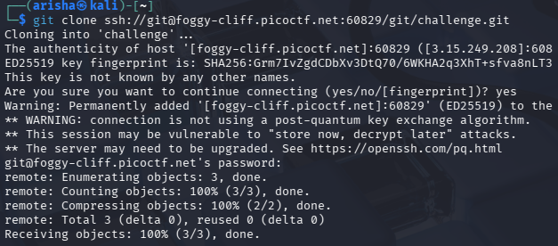

# MY GIT

## **Challenge Information**

- **Challenge Name:** MyGit
- **Platform:** picoCTF
- **Category:** General Skills / Web / Git
- **Difficulty:** Medium
- **Date Solved:** March 10, 2026

---

## **Description**

I have built my own Git server with my own rules!

You can clone the challenge repo using the command below:

`git clone ssh://git@foggy-cliff.picoctf.net:60829/git/challenge.git`

**Password:** `550851c0`

Check the README to get your flag!

---

## **Initial Thoughts**

- The challenge involves a custom Git server implementation.
- The hint "my own rules" suggests that the server performs some kind of server-side validation on pushes.
- The solution likely involves manipulating Git configuration or metadata to satisfy these specific "rules."
- Since the repository is accessed via SSH, the server likely uses **Git Hooks** (scripts that run on the server during a push) to check the incoming commit's details.

---

## **Tools Used**

| **Tool** | **Purpose** |
| --- | --- |
| **git** | Used to clone the repository, configure local user metadata, and commit/push changes. |
| **echo** | Used to create the dummy `flag.txt` file required by the server. |
| **cat** | Used to read the instructions within the `README.md` file. |

---

## **Step-by-Step Solution**

### **1. Cloning the Repository**

I started by cloning the provided repository using the SSH link and the password provided in the description.

`git clone ssh://git@foggy-cliff.picoctf.net:60829/git/challenge.git
cd challenge`

### **2. Analyzing the README**

After entering the directory, I checked the contents of `README.md` to find instructions on how to obtain the flag.

`cat README.md`

**Observation:** The README stated:

*"If you want the flag, make sure to push the flag! Only flag.txt pushed by root:root@picoctf will be updated with the flag."*

This revealed the core requirement: I needed to perform a `git push` where the commit author was specifically configured as `root` with the email `root@picoctf`.

### **3. Impersonating the Root User**

Git identifies authors based on local configuration (`user.name` and `user.email`), which is not verified by the client-side tool. To satisfy the server's rules, I updated the local Git configuration for this specific repository.

`git config user.name "root"
git config user.email "root@picoctf"`

### **4. Creating and Committing the File**

I created a file named `flag.txt` as required and committed it. Because of the configuration change in the previous step, the commit was created under the identity of "root".

`echo "give me the flag" > flag.txt
git add flag.txt
git commit -m "Pushing the flag"`

### **5. Pushing the Changes**

Finally, I pushed the commit to the remote server. The server-side hook validated that the **Author** was `root:root@picoctf` and the **Filename** was `flag.txt`, triggering the release of the flag.

`git push origin master`

---

## **Key Discovery**

The server-side Git hook was programmed to check the **Author metadata** and **Filename** of the incoming push. By using `git config` to change the identity of the user locally before committing, I was able to bypass the identity check and satisfy the server's requirements.

---

## **Final Flag**

`picoCTF{1mp3rs0n4t4_g17_345y_506743df}`

---

## Key Takeaways

- **Git Identity:** Git identifies authors based on local configuration, which can be easily spoofed unless the server enforces GPG signing.
- **Server Hooks:** Git servers use `pre-receive` or `post-receive` hooks to validate the content and metadata of a push before accepting it.
- **Commit Metadata:** Always check README files or commit histories in Git-based challenges for clues regarding required permissions or specific user identities.

---
