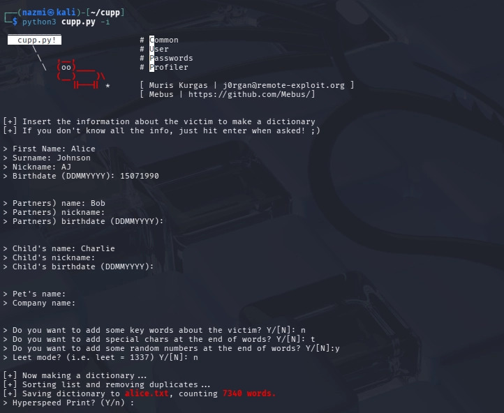
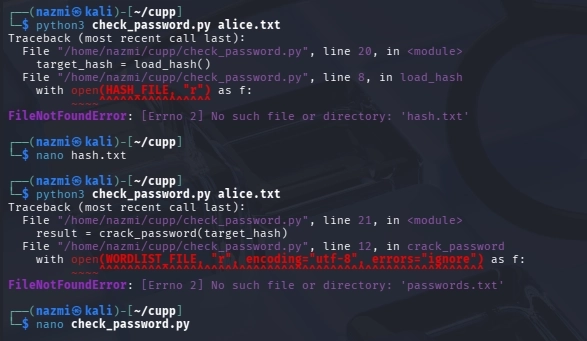
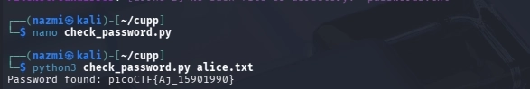

# Passwords Profiler

## **Challenge Information**

- **Challenge Name:** Password Profiler
- **Platform:** picoCTF
- **Category:** General Skills / OSINT / Cryptography
- **Difficulty:** Medium
- **Date Solved:** March 10, 2026

---

## **Description**

A suspicious system file was intercepted containing a **SHA-1 hash** instead of a plaintext password. Using provided personal details about the target (Alice Johnson), the goal is to generate a custom password list and recover the original password by matching it against the hash.

---

## **Initial Thoughts**

- The challenge is a classic targeted credential-cracking task.
- Generic wordlists like `rockyou.txt` are unlikely to work; a custom list based on the target's personal information is required.
- The hint suggests using **CUPP** (Common User Passwords Profiler), a tool designed to generate these specific combinations.
- A Python script (`check_password.py`) is needed to automate the comparison of each word in the list against the target hash.

---

## **Tools Used**

| **Tool** | **Purpose** |
| --- | --- |
| **CUPP** | Used to generate a targeted dictionary based on personal metadata. |
| **nano** | Used to create the SHA-1 hash file and edit the Python cracking script. |
| **Python3** | The environment used to run the password-matching script. |
| **chmod** | Used to make the Python script executable. |

---

## **Step-by-Step Solution**

### **1. Profiling the Target with CUPP**

I launched `cupp.py` in interactive mode and filled in the details found in the `userinfo` file:

- **First Name:** Alice
- **Surname:** Johnson
- **Nickname:** AJ
- **Birthdate:** 15071990
- **Partner/Child Names:** Bob and Charlie

I enabled the options to add random numbers at the end of words to capture common password patterns. This generated a dictionary file named **`alice.txt`** containing 7,340 potential passwords.

### **2. Preparing the Environment**

I verified the presence of the wordlist and the checking script in my directory. I then used `nano` to create `hash.txt` and paste the intercepted SHA-1 hash.

### **3. Troubleshooting Script Pathing**

When running the `check_password.py` script, 

I initially encountered several `FileNotFoundError` issues:

1. **Missing `hash.txt`:** The script couldn't find the target hash file until I created it.
2. **Hardcoded Filename:** The script was hardcoded to look for a file named `passwords.txt`, while my CUPP output was `alice.txt`.

I used `nano` to edit the script's internal variables to point to the correct files.

### **4. Cracking the Hash**

After correcting the script, I ran it against the `alice.txt` wordlist. The script hashed every entry in the list and compared it to the target until a match was found.

`python3 check_password.py alice.txt`

---

## **Key Discovery**

The original password followed a common human pattern: **`Nickname_Birthdate`**. Specifically, the cracked password was `Aj_15901990`. This highlights the effectiveness of using personal metadata (OSINT) to narrow down a search space from billions of possibilities to just a few thousand.

---

## **Final Flag**

`picoCTF{Aj_15901990}`

---

## **Lessons Learned**

- **OSINT Power:** Targeted wordlists are significantly more efficient than brute-force attacks for cracking individual user passwords.
- **Script Flexibility:** In CTFs, provided scripts often have hardcoded paths. Being able to read and modify Python code to match your environment is a vital skill.
- **SHA-1 Vulnerability:** While SHA-1 is no longer considered "secure" against collision attacks, it is still frequently found in legacy systems and remains susceptible to high-speed dictionary attacks.

