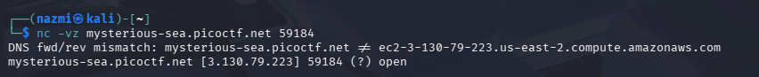

# Printer Shares

## **Challenge Information**

- **Challenge Name:** Printer Shares
- **Platform:** picoCTF
- **Category:** General Skills / Network / SMB
- **Difficulty:** Medium
- **Date Solved:** March 10, 2026

---

## **Description**

Oops! Someone accidentally sent an important file to a network printer—can you retrieve it from the print server?
The printer is on port `59184`.
**Target:** `mysterious-sea.picoctf.net`**Hint:** Knowing how the SMB protocol works would be helpful! `smbclient` and `smbutil` are good tools.

---

## **Initial Thoughts**

- The challenge involves interacting with a networked printer, which typically uses the **SMB (Server Message Block)** protocol for file sharing and print spooling.
- The mention of an "accidentally sent file" suggests that the file is sitting in a shared directory or a print queue.
- I need to enumerate the available "shares" on the server to find where the file might be stored.
- Since no credentials were provided, I will test for **Anonymous/Guest access** (Null Session).

---

## **Tools Used**

| **Tool** | **Purpose** |
| --- | --- |
| **netcat (nc)** | Used to verify if the specified port (`59184`) was open and reachable. |
| **smbclient** | The primary tool used to list available SMB shares and interactively download files from the server. |
| **cat** | Used to read the contents of the flag file on the local machine. |

---

## **Step-by-Step Solution**

### **1. Connection Testing**

I started by checking if the port was open using `nc`. The output confirmed that the port was indeed open.

`nc -vz mysterious-sea.picoctf.net 59184`

### **2. Enumerating SMB Shares**

Using `smbclient`, I listed the available shares on the server. I used the `-N` flag for a "null session" (no password) to see if guest access was permitted.

`smbclient -L //mysterious-sea.picoctf.net -p 59184 -N`

The enumeration revealed two shares:

- `IPC$`: Standard IPC service.
- **`shares`**: Commented as "Public Share With Guests". This was the primary target.

### **3. Connecting to the Share**

I attempted to connect directly to the `shares` directory.

`smbclient //mysterious-sea.picoctf.net/shares -p 59184 -N`

### **4. Locating and Retrieving the Flag**

Once inside the SMB interactive shell, I performed the following actions:

1. Ran `ls` to list the files, identifying `flag.txt`.
2. Used the `get` command to download the file to my local machine.
3. Exited the SMB session.

Bash

`smb: \> ls
smb: \> get flag.txt
smb: \> exit`

### **5. Reading the Flag**

Back in my local terminal, I used `cat` to reveal the flag stored inside the file.

Bash

`cat flag.txt`

---

## **Final Flag**

`picoCTF{5mb_pr1nter_5h4re5_8a0df8e0}`

---

## **Key Takeaways**

- **SMB Misconfigurations:** Allowing anonymous or guest access to sensitive shares (like print spoolers) is a major security risk that can lead to data leaks.
- **Service Enumeration:** Identifying the specific share name (`shares`) is a crucial middle step between finding an open port and actually accessing the data.
- **SMB Protocol Interaction:** Unlike standard Linux shells, the `smbclient` environment uses specific commands like `get` to transfer files rather than just viewing them with `cat` directly on the server.
