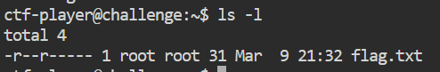

# SUDO MAKE ME A SANDWICH

## **Challenge Information**

- **Challenge Name:** SUDO MAKE ME A SANDWICH
- **Platform:** picoCTF
- **Category:** Linux / Privilege Escalation
- **Difficulty:** Easy
- **Date Solved:** March 11, 2026

---

## **Description**

Can you read the flag? I think you can! This challenge provides SSH access to a remote Linux environment and hints at exploring permissions and the `sudo` command to read a restricted flag file.

---

## **Initial Thoughts**

- The challenge title and description refer to the `sudo` command, which allows users to run programs with the security privileges of another user (usually root).
- The goal is likely to read a `flag.txt` file that is owned by root and restricted from the standard `ctf-player` user.
- I need to identify which binary has been granted `sudo` permissions without a password requirement.

---

## **Tools Used**

| **Tool** | **Purpose** |
| --- | --- |
| **SSH** | Used to connect to the remote challenge server. |
| **sudo -l** | Used to enumerate the commands the current user is permitted to run as root. |
| **Emacs** | A powerful text editor that was used to bypass file permissions once granted root access. |

---

## **Step-by-Step Solution**

### **1. Initial Access and Reconnaissance**

I logged into the server using the provided SSH credentials and checked the current directory for the flag.

Bash

`ls -l`

**Observation:** The output showed `flag.txt` owned by `root:root` with permissions `-r--r-----`, meaning only root and members of the root group could read it. Attempting to read it with `cat flag.txt` resulted in a "Permission denied" error.

### **2. Checking Sudo Permissions**

Following the hint about checking permissions, I ran the command to list allowed sudo executions:

Bash

`sudo -l`

**Result:**

`(ALL) NOPASSWD: /bin/emacs`

This indicated that the `ctf-player` user can run the **Emacs** editor as the superuser without providing a password.

### **3. Exploiting the Emacs Binary**

Since Emacs can read any file when run as root, I "sandwiched" the flag file into the editor using `sudo`:

Bash

`sudo emacs flag.txt`

Once the Emacs interface opened, the contents of the flag were displayed in the main buffer.

### **4. Exiting the Editor**

After retrieving the flag, I used the standard Emacs shortcut to exit:

- **Ctrl + X**, then **Ctrl + C**.

---

## **Vulnerability Analysis**

The vulnerability in this challenge is **Sudo Misconfiguration (Binary Escape)**.

- **The Root Cause:** The system administrator allowed a non-privileged user to run a highly complex and versatile binary (`/bin/emacs`) with root privileges.
- **The Exploit:** Programs like `emacs`, `vi`, or `more` can be used to read sensitive system files (like `/etc/shadow` or CTF flags) if they are granted `sudo` access, as they inherit root's ability to bypass standard file permissions.

---

## **Final Flag**

picoCTF{ju57_5ud0_17_f6cc9dec}

---

## **Lessons Learned**

- **Principle of Least Privilege:** Never grant `sudo` access to binaries that have built-in features to read files, write files, or execute shell commands unless absolutely necessary.
- **Enumeration is Key:** Always run `sudo -l` early in a Linux CTF to find your path to privilege escalation.
- **GTFOBins:** Complex binaries often have "escape" methods that can be used to upgrade from just reading a file to getting a full root shell.
