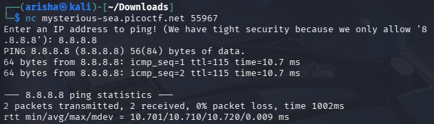

# ping-cmd

# CTF Writeup

## Challenge Information

**Challenge Name:** Command Injection
**Platform:** picoCTF

Author: Yahaya Meddy
**Category:** General Skills
**Difficulty:** 100 points
**Date Solved:** 2026-03-12

---

## Description

Can you make the server reveal its secrets? It seems to be able to ping Google DNS, but what happens if you get a little creative with your input?
You can connect to the service here: `nc mysterious-sea.picoctf.net 55967`

---

## Initial Thoughts

- The challenge title and description hint at "getting creative" with input for a ping command.
- The mention of "running more than one command at a time" suggests **Command Injection**.
- This is likely a backend vulnerability where user-supplied data is passed directly to a system shell.

---

## Files Provided

- No local files were provided. Interaction with the remote server via Netcat was required to explore the filesystem.

---

## Investigation

### Step 1: Establishing a Connection

I connected to the remote server to see how it handles input.

**Command used:**`nc mysterious-sea.picoctf.net 55967`

**Observation:**
The server prompts for an IP address. Entering `8.8.8.8` triggers a standard Linux `ping` command.

### Step 2: Testing Command Injection

I attempted to chain a second command using the semicolon (`;`) metacharacter to see if the server would execute it.

**Command used (at the prompt):**`8.8.8.8 ; ls`

**Observation:**
The server executed the ping and then listed the files in its current directory:

- `flag.txt`
- `script.sh`

### Step 3: Local vs. Remote Confusion (Common Pitfall)

After seeing `flag.txt` in the remote list, I mistakenly tried to read it from my own terminal after the connection closed.

**Command used (on my Kali terminal):**`cat flag.txt`

**Result:**`picoCTF{fake_flag}`

**Observation:**
This was a **fake flag** located in my local `~/Downloads` folder. Because the `nc` session had ended, my terminal was executing commands on my local machine, not the target server.Step 4: Successful Retrieval

To get the real flag, the `cat` command must be sent *through* the injection point while the connection is still active.

**Command used (at the server prompt):**`8.8.8.8 ; cat flag.txt`

**Observation:**
The server processed the `cat` command on its own filesystem and returned the actual flag string.

---

## Key Discovery

The vulnerability is a classic **Command Injection**. The server-side code likely resembles `system("ping " + input)`, allowing an attacker to use shell operators (`;`, `&&`, `|`) to execute arbitrary code. The most critical lesson was distinguishing between the **remote shell environment** (inside Netcat) and the **local shell environment** (my Kali terminal).

---

## Flag

picoCTF{p1nG_c0mm@nd_3xpL0it_su33essFuL_252214ae}

---

## Lessons Learned

- **Stay in the Session:** Always ensure your commands are being sent to the remote target and not executed locally.
- **Input Sanitization:** Developers must validate that input is strictly an IP address to prevent this attack.
- **Shell Operators:** The semicolon `;` is a powerful tool for bypassing intended application logic.

---

## Tools Used

- **Netcat (nc):** To interact with the remote service.
- **Linux Shell:** For command chaining and file navigation.